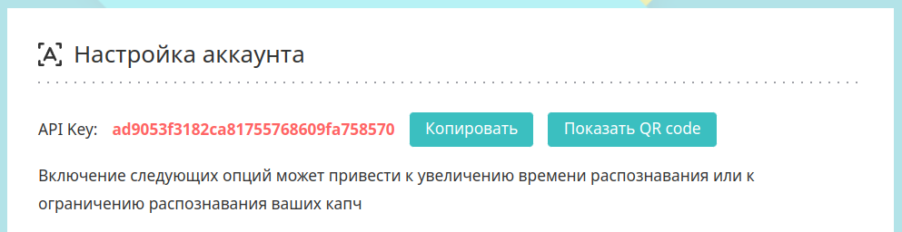

# python-rucaptcha

[](https://badge.fury.io/py/python-rucaptcha)
[](https://codeclimate.com/github/AndreiDrang/python-rucaptcha/maintainability)


Библиотека предназначена для разработчиков ПО и служит для облегчения работы с API сервиса RuCaptcha.

Присутствуют [примеры работы с библиотекой](src/examples).

***
По всем вопросам можете писать в [Telegram](https://t.me/pythoncaptcha) чат.

Либо на email - python-captcha@pm.me
***

**Используется Python версии 3.6+.**

## How to install? Как установить?

### pip

```bash
pip install python-rucaptcha
```


### Source
```bash
git clone https://github.com/AndreiDrang/python-rucaptcha.git
cd python-rucaptcha
python setup.py install
```
### Changelog

v.4.0 - Переработка классов и методов. Добавление `TikTok` captcha. Добавление наследований и сериализаторов. `Callback-сервер` - deprecated.

v.4.0 - Reworking of classes and methods. Adding `TikTok` captcha. Adding inheritances and serializers. `Callback-server` - deprecated.

***

## [All examples. Все примеры работы с бибилиотекой](src/examples)

***
Для тестирования различных типов капчи предоставляется [специальный сайт](https://pythoncaptcha.xyz/), на котором собраны все имеющиеся типы капчи, с удобной системой тестирования ваших скриптов.

To test various types of captcha, a [special site](https://pythoncaptcha.xyz/) is provided, which contains all available types of captcha, with a convenient system for testing your scripts.

***
### Errors description. Описания ошибок

1. https://rucaptcha.com/api-rucaptcha#in_errors
1. https://rucaptcha.docs.apiary.io/#reference/2


