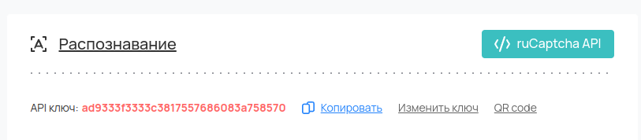

# python-rucaptcha

[](https://badge.fury.io/py/python-rucaptcha)
[](https://codeclimate.com/github/AndreiDrang/python-rucaptcha/maintainability)
[](https://pepy.tech/project/python-rucaptcha)


The library is intended for software developers and serves to facilitate work with the RuCaptcha service API.

If you have any questions, please write to [Telegram](https://t.me/pythoncaptcha) chat. 
Or to [email](python-captcha@pm.me).

***


## How to install?

### pip

```bash
pip install python-rucaptcha
```

### Source
```bash
git clone https://github.com/AndreiDrang/python-rucaptcha.git
cd python-rucaptcha
python setup.py install
```
### Changelog

v.4.0 - Rework classes and methods. Adding `TikTok` captcha. Adding inheritance and serializers. The `Callback server` is deprecated.

v.4.2 - Added [Yandex Smart Captcha](https://rucaptcha.com/api-rucaptcha#yandex).

***

## [All examples of working with the library](src/examples)

***

To test various types of captcha, a [special site](https://pythoncaptcha.xyz/) is provided, which contains all available types of captcha, with a convenient system for testing your scripts.

***

### Errors description

1. https://rucaptcha.com/api-rucaptcha#in_errors
2. https://rucaptcha.docs.apiary.io/#reference/2

### Get API Key to work with the library
1. On the page - https://rucaptcha.com/enterpage
2. Find it: 
